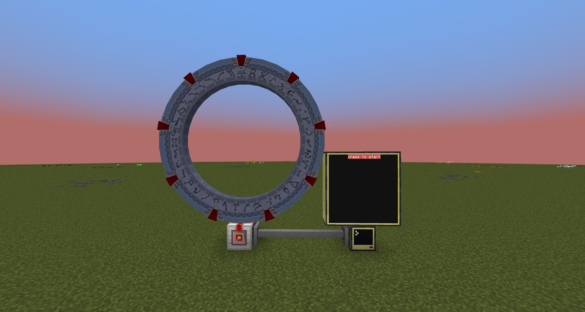
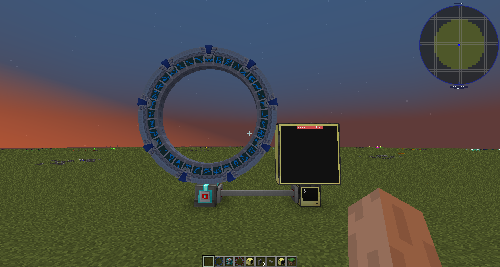
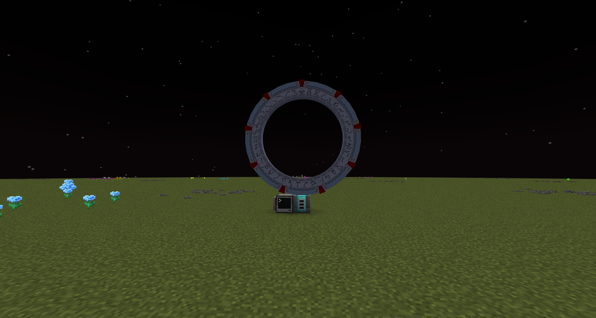

simply put this is a program to help dial stargates,

DISCLAIMER: I AM NOT A PROFESSIONAL PROGRAMMER, I JUST WANT TO SHARE MY PROJECT

NOTE: THE WIRELESS DIAL PROGRAM IS STILL IN PROGRESS YOU MIGHT HAVE TO MODIFY THE GATES THAT I HAVE SETUP TO YOURS IN THE MEANTIME

TOUCH SCREEN GATE DIALING MONITOR

requirements for a milky way gate are as follows:

    - Milky Way Gate
    - basic interface or higher
    - Advanced monitor 3x3 or taller
    - attachment via wired modem

you need to update the gate addresses in the beginning of the code in the format of (make sure the last number is always zero(0)) 7, 8, and 9 chevron addresses are viable for gates

        {"gatename",    1,1,1,1,1,1,0} --gatename not required here but can make it easier to read

    

it should look like this:

the only difference whith other gates is that you need to have an
avanced crystal interface to work with the gates (including pegasus, tollan, classic and universe gates)

looking like this:

note: to disconnect stargate: just rightclick the screen once the wormhole is connected

in the config there are four lists for your use:

    -- MAIN GATES for those gates that are mostly dialled with 7 chevron addresses
    -- player gates for those gates that are direct dialing other players bases (mostly 9 cheveron addresses)
    -- hazard gates for gates that are hostile on the destination
    -- private 9 cheveron gates for specific players

you are welcome to just use the first list only  but you may run out of room quickly as i havent figured out how to do continued pages as of yet

WARNING: misdialing gates causes the program to break you need to restart the program if this happens

WIRELESS GATES

setting up a wireless gate is a bit more expensive for all gates. here is what you need:

    - advanced WIRELESS pocket computer
    - basic computer
    - wireless modem (NOT AN ENDER MODEM YOU WILL WIND UP DIALLING ALL OF YOUR GATES AT THE SAME TIME)
    - gate(any gate works the same in this one)
    - advanced crystal interface (CANNOT BE LOWER AS IT DIRECT ENCODES THE CHEVERONS)

the setup should look like this:

note: you should be able to disconnect the gate on either side by clicking on the green screen with the name of the address you just dialed.

to set up the tables just upload the same program to the tablet

note: these programs do work together on the same wired network attached to the stargate if that is what you want to do

WARNING: THIS PROGRAM IS STILL INCOMPLETE. i will be updating it soon though

[donate!](https://pally.gg/p/mystdrakonoid)